# Phase 5: Process, CI & In-Tree Sweep - Research

**Researched:** 2026-08-15
**Domain:** Contributor surfaces (.github), CI workflows, in-tree comment sweep, one capability removal
**Confidence:** HIGH

## User Constraints (from CONTEXT.md)

### Locked Decisions

- **D-01:** Comparison framing = **references to the prior implementation as a comparison baseline** ("matches TS", "parity with the original", "drop-in", "vs the TS version", "behavioral parity"). These are removed. — **Reversibility:** reversible — comment edits.
- **D-02:** Product truth **stays**: `tsextract` and other package names, the language registry, the capability matrix, `TypeScript` as an indexed language, and **past-tense history** ("began as a rewrite of", "was originally based on"). Every retained use is resolved **term-by-term with a recorded reason, never by regex** — the naive-regex failure mode is named in the requirements (a find-and-replace over "TypeScript" breaks `tsextract` and de-lists a supported language). — **Reversibility:** reversible.
- **D-03:** The `syntheticParitySrc` residual (`testdata/golden/behavioral_test.go:239`) is a **Go code identifier** carrying the retired "parity" name — Phase 4 flagged it to Phase 5. It is CODE-01's scope (rename to a behavioral name). The matrix `golden-parity` code comments (`matrix.go:18,32`, `matrix_test.go:217,221`) are also CODE-01's scope. — **Reversibility:** reversible — identifier rename.
- **D-04:** `codegraph migrate` is **removed entirely** (maintainer ruling 2026-08-15): the command registration in `internal/cli/root.go`, the whole `internal/migrate/` package (migrate.go, reader.go, translate.go, swap.go, validate.go, progress.go, batchwriter.go + tests + `migratetest/` fixture + `archtest/` confinement test), and the `modernc.org/sqlite` sole-use dependency (with its `modernc.org/libc` / `modernc.org/mathutil` indirect deps). Nothing left referencing it. — **Reversibility:** one-way — recreates no capability; a TS user re-indexes from source. Restorable only from git history (the archived build phase `milestones/v0.1-phases/07-migration-tool` stays).
- **D-05:** The project's framing is on its own terms — a code knowledge graph with a pre-indexed query surface, not a drop-in alternative to any prior implementation. The "uninstall TS CodeGraph... migrate indexes... works the same or better" core-value text is itself competitive framing (the parity story), not a binding constraint. Where it appears in the swept surfaces it is removed as framing, not product truth.

### Claude's Discretion

- The exact rewording of each contributor-facing template, provided it is on codegraph-go's own terms and carries no comparison framing.
- The exact new name for `syntheticParitySrc` (a behavioral name consistent with the Phase 2 rename).
- The order of the internal//tools//test/ comment sweep (which packages first).

### Deferred Ideas (OUT OF SCOPE)
- `bench.yml`'s own de-coupling (removing the comparison runner) — Phase 6.
- `docs/BENCHMARKS.md` rewrite — Phase 6.
- The memory sweep (MEM-01/02) — Phase 6.
- Whether to restore migrate later — a future decision; nothing is deleted from git history.

---

<phase_requirements>
## Phase Requirements

| ID | Description | Research Support |
|----|-------------|------------------|
| PROC-01 | 5 issue templates carry no comparison framing | §5.1: feature_request.yml:17–20/51/55–61; enhancement.yml:63–66; chore.yml:56; bug_report.yml/config.yml clean |
| PROC-02 | PR template + 3 variants carry no comparison framing | §5.2: pull_request_template.md:34–40; feature.md:44–49; enhancement.md:65–68; fix.md clean. `scripts/pr_template_policy.py` TEMPLATE_SIGNALS does not key on "Parity" — section removal is safe |
| PROC-03 | Workflows pass actionlint + own checks; no framing in job/step names/comments | §6 + §6.2: binding constraints = required-check names (ruleset 20157557), in-scope jobs bind `run:` bodies only (not step names), actionlint 1.7.12 baseline clean |
| CODE-01 | Code comments in `internal/` `tools/` `test/` carry no comparison framing, term-by-term with reasons; `tsextract`/registry/matrix preserved | §4 = the planner's work list (~120 hits classified; stale `golden_parity_test.go` filename citations enumerated) |
| CODE-03 | `codegraph migrate` removed entirely (command, package, fixture, archtest, `modernc.org/sqlite` dep), nothing left referencing it | §3 = the exact 4,018 (package) + 258 (CLI) line removal footprint, 28 go.sum lines, and the coupled edit sites (graphstore cursor API, golden_test subtests, README, nodeid comment) |

</phase_requirements>

---

## Summary

Phase 5 removes two classes of in-tree content on codegraph-go's own terms: (1) the **stateful `codegraph migrate` capability** (D-04, one-way) and (2) **comparison framing** across four surfaces (contributor-facing templates/workflows, in-tree comments). It is a deletion + reword phase, not an authoring phase: no new dependency, no new file of consequence, and the danger is almost entirely **incomplete enumeration** (a missed reference fails a criterion) and **subtle build-Gate coupling** (deleting the ts-schema fixtures breaks `TestGoldenFixturesExist` subtests; renaming a step that a test fixture keyed on breaks the fixture; editing a proto comment without regenerating `graph.pb.go` creates a doc/registry mismatch).

**The migrate removal's true blast radius is bigger than the package.** Under `internal/migrate/` (4,018 lines) plus `internal/cli/migrate.go`/`migrate_test.go` (258 lines), the removal reaches: the `GetMigration`/`PutMigration`/`migrationRecordName="migration"` cursor API in `internal/graphstore` (Reader/Writer interfaces, pebble impls, meta-key const, a 173-line `migration_record_test.go`, and 8 test-fake stubs across `internal/indexer` + `internal/query`); the three `testdata/golden/ ts`, `ts-schema.dump.sql`, `ts-version.txt` fixture files and the two golden-suite subtests that assert their existence; the `README.md` commands table; `testdata/golden/README.md`'s description of them; `internal/indexer/nodeid`'s comment citing `ts-schema.dump.sql`; and `go.mod`/`go.sum` (28 modernc.org lines). It does **not** reach the MCP server (no tool named migrate), nor the agent installers (`internal/agents/.migrated` markers are a separate legacy-config-install concept that stays).

**The comparison-framing census is the planner's work list and it is larger than the phase's CONTEXT summary implies.** The `internal/query` package alone carries "ports TS CodeGraph 1.3.1's" in six file headers (expand, explore_gate, gather, scoring, seeding, tokenize) plus dozens of "ported VERBATIM from TS" bodies; there is a further TS-parity family in `internal/{cli,githooks,gitmeta,watch,indexer,agents}`. Beyond the two Phase-4-acknowledged residuals (`syntheticParitySrc`, matrix `golden-parity`), the census found the **same identifier family un-flagged in `internal/query/explore_test.go`** (`copySyntheticParityFixture`, `syntheticParityEngine`) and **four `corpus/behavioral/src/** comments naming the retired "synthetic-parity corpus"** — the corpus is Phase 2's FIXT but the src-comment residual was not swept. Rewording a corpus src comment changes bytes embedded in `go-explore-multi.json`/`go-node-multi.json`, so it forces a golden re-freeze; CONTEXT says Phase 5 does not touch the golden harness — this tension is an explicit open question (q-1). Identifiers in the codebase that use "parity" to mean **in-repo agreement between two restatements** (e.g. `TestGoreleaserPinParity`, `TestCosignIdentityPolicyBoundaryParityWithCompiledPattern`) are not comparison framing under D-01 and stay, with a recorded reason.

**Primary recommendation:** execute the phase as five isolated diffs — (1) migrate removal including the graphstore cursor-API cut; (2) golden-fixture / `golden_test.go` / `testdata/golden/README.md` ripple; (3) the CODE-01 comment census in `internal/` then `tools/` then `test/`; (4) PROC-01/02 template rewrites (safe — the format gate does not key on the Parity heading); (5) PROC-03 workflow comment/step-name sweep (all step-name edits; zero job-name edits because all required-check job names are already clean). Keep the golden re-freeze (if corpus comments are swept) as its own reviewed diff. Run `go mod tidy` as part of the migrate cut and verify `go build ./...`.

---

## Architectural Responsibility Map

| Capability | Primary Tier | Secondary Tier | Rationale |
|------------|-------------|----------------|-----------|
| `codegraph migrate` CLI command | — | — | Capability deleted (D-04); its register site is `internal/cli/root.go:59` |
| Migration SQLite read path | API / backend | — | `internal/migrate/` whole package deleted; `modernc.org/sqlite` confined here only, archprotected — both go |
| Migration-progress cursor (`m/migration` meta) | Database / Storage | — | `graphstore.GetMigration/PutMigration +migrationRecordName` — sole caller is the deleted package; interface impl + test + stubs delete with it |
| `ts-schema.sql`/`ts-schema.dump.sql`/`ts-version.txt` fixtures | testdata | — | Sole consumers are `internal/migrate` + `TestGoldenFixturesExist` subtests — both deleted |
| Issue/PR templates + workflow prose | Repository surface | version | Contributor-facing (PROC-01/02/03) — text edits only, run-body unchanged |
| Comments in `internal/` `tools/` `test/` | Repository surface | — | CODE-01 term sentence (term-by-term, never regex) |
| `tsextract`, language registry, capability matrix, TypeScript-as-indexed-language | Backend / product surface | — | Product truth (D-02) — untouched by framer; only the *golden-parity* comments (`matrix.go,18,32`, `matrix_test.go:217,221`) are reworded |

---

## Standard Stack

This phase installs **no new dependency** — it deletes one. There is therefore no Standard Stack table; the relevant "stack" facts are:

| Dependency | Action | Verification |
|------------|--------|--------------|
| `modernc.org/sqlite v1.53.0` (go.mod:40, direct) | remove | `go mod why modernc.org/sqlite` → only `internal/migrate` (verified) |
| `modernc.org/libc v1.73.4`, `modernc.org/mathutil v1.7.1`, `modernc.org/memory v1.11.0` (go.mod:160–162, indirect) | remove | all four only reachable via the removed package (verified; §3) |
| 28 `go.sum` lines (h1+go.mod pairs for 14 modules: `modernc.org/{cc/v4,ccgo/v4,fileutil,gc/v2,gc/v3,goabi0,libc,mathutil,memory,opt,sortutil,sqlite,strutil,token}`) | prune | after deleting `internal/migrate/`+`internal/cli/migrate*` run `go mod tidy` then `go build ./...` `go vet ./...` |
| `actionlint` 1.7.12 | already installed | `task lint:actions` baseline is exit 0 over all 14 workflows today (§D) |
| `task` 3.52.0, `go` 1.26.5 | already installed | `go test ./...` + `go test ./testdata/golden/...` gates |

**Version-verification note:** no new packages are recommended, so the package-legitimacy gate below documents only the dependency being removed.

---

## Package Legitimacy Audit

This phase **installs no external packages**; it removes one (plus its four-module transitive closure). The gate is therefore reported as a removal record:

| Package (Removed) | Registry | Verdict context at removal | Why removed | Disposition |
|--------------------|----------|---------------------------|-------------|-------------|
| `modernc.org/sqlite` v1.53.0 | proxy.golang.org (Go module) | Legitimate widely-used pure-Go SQLite driver | Sole-use dependency of the deleted `internal/migrate` reader (D-04) | REMOVED |
| `modernc.org/libc` / `mathutil` / `memory` | Go module (indirect) | Legitimate upstream deps | Only reachable through `modernc.org/sqlite` | REMOVED (after `go mod tidy`) |

**Packages removed due to [ASSUMED]/[SLOP] verdict:** none — no new package is introduced; `go.mod` only loses lines.
**Packages flagged as suspicious [SUS]:** none.

---

## Architecture Patterns

### System Architecture Diagram (data flow of this phase's change surface)

```mermaid
flowchart TD
    B[contributor] -->|filing an issue| I[.github/ISSUE_TEMPLATE/&#42;.yml 5 files]
    B -->|opening a PR| P[pull_request_template.md + 3 variants]
    B -->|mentions PR| W[14 workflows]
    B -->|reads source| C[comments in internal/ tools/ test/]
    I -->|templated text| PH[policy script pr_template_policy.py]
    W -->|step run:| T[Taskfile.yml targets]
    W -->|name: fields| R[GitHub ruleset #20157557 required-check names]
    C -->|term-by-term| X[census table of framing hits]
    T -->|lint:actions| A[actionlint]
    J[go.mod] ---|modernc.*| V[internal/migrate pkg]
    V -->|GetMigration/PutMigration| G[internal/graphstore + 8 test-fakes]
    V -->|ts-schema fixtures| GL[testdata/golden ts-*.sql + golden_test.go]
    V -->|codegraph migrate cmd| ROOT[internal/cli/root.go + README]
```



Arrows that must hold after the cut: `B→P→PH` (removing the `## Parity` heading section is policy-safe), `CI→J` (a job-name edit would drop a required status check — the sweep uses **zero** job-name edits), `T→A` (actionlint exits 0 today, re-verify after edits), `V→G` (cursor API carries the same `migration` name as the deleted package — include in the cut), `V→H` (golden_test two subtests fail if fixtures go — remove them in the same diff).

### Pattern 1: The migrate removal cut list

**What:** Delete the command, the package, the dependency, and every orphaned reference that only the migration existed to serve.
**When to use:** this phase only (CODE-03).
**File:line-precisely enumerated in Census §3.**

### Pattern 2: Term-by-term with recorded reasons, never regex

**What:** the CODE-01 sweep line. For each hit, classify as:
- **F = comparison framing** → remove/reword.
- **S = stale filename** (references renamed/removed `golden_parity_test.go`, `parity_ts_test.go`, `parity_python_test.go`) → reword to `behavioral_*_test.go` or "the golden suite".
- **R = in-repo restatement agreement** (`TestGoreleaserPinParity`, cosign SAN agreement, `parity across every restatement` in taskfile_shape_test.go) → **keep**, record reason: "agreement between two in-repo restatements, not comparison to the prior implementation".
- **T = TypeScript as indexed language** (tsextract, language registry, node/tokenization…) → **keep**, reason recorded.
- **PT = past-tense history** (root.go:13 "Go-only surface extension with no TS CodeGraph counterpart", release-pipeline "migrated", agents' per-install legacy migration) → **keep**.

**Anti-rule (the phase's named failure mode):** a direct `sed`/`rg -l -e 'parity'` find-replace **breaks `tsextract`** and would de-list a supported language. The CODE-01 census in §4 **is** "the planner's work list".

---

## §3 MIGRATION-REMOVAL BLAST RADIUS (CODE-03) — enumerated

### 3.1 Whole-package delete: `internal/migrate/` (4,018 lines)

| File | Lines |
|---|---|
| `internal/migrate/migrate.go` | 847 |
| `internal/migrate/migrate_test.go` | 789 |
| `internal/migrate/reader.go` | 320 |
| `internal/migrate/reader_test.go` | 387 |
| `internal/migrate/translate.go` | 242 |
| `internal/migrate/translate_test.go` | 384 |
| `internal/migrate/swap.go` | 103 |
| `internal/migrate/swap_test.go` | 169 |
| `internal/migrate/validate.go` | 368 |
| `internal/migrate/validate_test.go` | 331 |
| `internal/migrate/progress.go` | 79 |
| `internal/migrate/progress_test.go` | 165 |
| `internal/migrate/batchwriter_test.go` | 110 |
| `internal/migrate/migratetest/fixture.go` | 259 |
| `internal/migrate/migratetest/fixture_test.go` | 111 |
| `internal/migrate/archtest/modernc_confinement_test.go` | 92 |

The archtest (`modernc_confinement_test.go`) is a `go/packages` import-graph gate asserting `modernc.org/sqlite` is confined to `internal/migrate/*` **and** a vacancy check that the package still imports it. Both halves die with the package.

### 3.2 CLI command + registration

- `internal/cli/migrate.go` (141 lines) — `newMigrateCmd`, `dirNonEmpty`, `printMigrateReport`.
- `internal/cli/migrate_test.go` (117 lines) — 4 tests.
- `internal/cli/root.go:9` doc comment ("migrate (D-08, phase 08) is the one-step TS-SQLite -> Pebble store conversion"), `:35` ("daemon lock — and migrate (D-08), the one-step TS CodeGraph SQLite -> new-format Pebble store conversion"), `:59` `AddCommand(... newMigrateCmd(), ...)`. Rewrite the doc comments to drop migrate from the enumeration (part of the already-census'd framing work).

### 3.3 The graphstore cursor API (widest ripple)

`GetMigration`/`PutMigration`/`migrationRecordName = "migration"` are the progress cursor the migration package writes. Sole caller = `internal/migrate/progress.go`. If left behind after the cut they are dead API AND carry the retired word AND their comments name `internal/migrate`. Delete:

| Site | What |
|------|------|
| `internal/graphstore/store.go:51–56` | `Reader.GetMigration` method + doc |
| `internal/graphstore/store.go:197–203` | `Writer.PutMigration` method + doc |
| `internal/graphstore/pebble_store.go:278–282` | `GetMigration` impl |
| `internal/graphstore/batch.go:113–118` | `PutMigration` impl |
| `internal/graphstore/keys.go:195–204` | `migrationRecordName` const "migration" + doc |
| `internal/graphstore/migration_record_test.go` | whole 173-line round-trip/idempotent/ErNotFound test |
| Stub fakes (impl the old interface): | `internal/indexer/resolve_test.go:1033` (`PutMigration`); `internal/query/{expand,gather,scoring,search,seeding,traverse}_test.go` (`GetMigration` stubs) — remove in the same cut (they would otherwise keep the retired word in test code) |

Removing the two methods from the interfaces is **compile-safe for all implementors** (Go only breaks when a call site — and there are none outside `internal/migrate` and the stubs themselves).

### 3.4 `ts-schema` fixtures + golden-suite cascade (the "what breaks if removed" part)

| Surviving consumer | Action |
|--------------------|--------|
| `testdata/golden/golden_test.go:66–75` subtest "ts-schema.sql exists and is non-empty" | remove subtest (fails after file deleted) |
| `testdata/golden/golden_test.go:77–88` subtest "ts-version.txt exists…codegraph_version=" | remove subtest |
| `testdata/golden/README.md:10–13` bullet describing "Phase 7's one-way migration reader" + `:59–85` "Historical bug note (Pitfall 2)" referencing "the TS project"/upstream issue #1034/the Go port | rewrite (drifts + framing) |
| `internal/indexer/nodeid/nodeid.go:36–38` comment citing `testdata/golden/ts-schema.dump.sql` | reword citation (fixture gone) |

Decision (planner must confirm; D-04's "nothing left referencing it" supports deletion):
- **Recommendation: delete** `ts-schema.sql`, `ts-schema.dump.sql`, `ts-version.txt` with the migrate cut (they are the legacy-schema ground truth for the removed reader). If instead they are kept as inert reference, the `golden_test.go` and `testdata/golden/README.md` edits still happen but describe "historical record". Recommendation is deletion.
- **Effect on `TestGoldenScenarioCountIsExact`** (`golden_test.go:332–357`): unaffected — it counts `expectedGoCaptures` families + `CASES.json` cases (30 total), not the ts-fixture files.

### 3.5 command-table and product doc surfaces

- `README.md:137` — `| migrate | import an existing TypeScript CodeGraph index |` row in Commands table → drop row.
- `internal/cli/man.go` — auto-generates from the Cobra tree; no manual edit; the entry disappears with the command.
- MCP server (`internal/mcp/server.go`) exposes **no** migrate tool and no resource mentioning migrate — verified.
- `internal/agents/*.migrate*` — **false positives, keep**: `.migrated` markers in `~/.gemini/…` and legacy `.claude.json` entry migration are a different legacy-install concept, not the command.

### 3.6 `go.mod` / `go.sum` results (verified with `go mod why`)

```
modernc.org/sqlite → github.com/.../internal/migrate
modernc.org/libc    → …/internal/migrate → modernc.org/sqlite
modernc.org/mathutil → …/internal/migrate → modernc.org/sqlite → libc
modernc.org/memory   → …/internal/migrate → modernc.org/sqlite → libc
```
All four are only reachable through `internal/migrate`. After `rm -rf internal/migrate internal/cli/migrate.go internal/cli/migrate_test.go`, run `go mod tidy` (go 1.26.5) — the whole modernc.org require block (go.mod:40 direct + :160–162 indirect) and 28 modernc.org go.sum lines drop; they are the sole require lines removed, and nothing else in go.mod depends on them (verified `go mod why` for the four).

---

## §4 CODE-01 IN-TREE COMPARISON-FRAMING CENSUS (the planner's work list)

Classification legend: **R** = rewrite (comparison framing), **S** = stale filename (file was renamed/removed), **K** = keep + record reason (in-repo restatement / past-tense history / product surface).

### 4.1 `internal/query` (flagship surface)

| File:line | Text | Class |
|---|---|---|
| expand.go:1 | "…internal/query/expand.go ports TS CodeGraph 1.3.1's…" | R |
| expand.go:2–3 | "…ported VERBATIM…" | R |
| explore_gate.go:1 | "…explore_gate.go ports TS CodeGraph…" | R |
| explore_gate.go:13,15 | "ports under-selects files TS would… ported independently-sufficient" | R |
| gather.go:1 | "…gather.go ports TS CodeGraph 1.3.1's…" | R |
| gather.go:89 | "ported verbatim for behavioral parity" | R |
| gather.go:218,585,749 (in-plan references) | "…once getStemVariants is ported" / "deferred porting…" / "ported as a separate function" (variations) | R (rewrite "ported"→"implemented" / drop TS source) |
| node.go:92,96,148 | "TS's GENERATED_PATTERNS list ported VERBATIM… byte-for-byte regex port" | R |
| node_test.go:130, node.go:310,413, node_test.go:67 | "verbatim port of TS's GENERATED_PATTERNS" / "original single-def path" | R |
| render_markdown_test.go:236 | "TS-parity tokenizers (H1/H2)" | R-TS-name-is-origin |
| render_status.go:14,20,212,226,228,266 | "ported from mcp/tools.js ~3890–3945…" / "ported from bin/codegraph.js ~900–985" | R |
| render_results.go:9,12 | "would silently break the CLI contract and the golden parity harness… golden_parity_test.go's shape oracle" | R+S (stale filename) |
| render_results.go:151 | "ports internal/cli/files.go's printFileTree…" | K (in-repo pipeline) |
| rwr.go:1, "EXPL-02 load-bearing" | "ports…" | R |
| scoring.go:1, seeding.go:1, tokenize.go:9,45,86,89,100,152,154 | "ports TS CodeGraph 1.3.1's H1/H2…" / "ported verbatim from TS CodeGraph 1.3.1's search/query-utils.js" | R |
| search.go:192 | "camelCase keys matching the TS capture… three TS-only boolean concepts… literal false to keep JSON shape parity" | R |
| search_test.go:441 | "missing TS-only bool key %q (D-05 shape parity)" | R |
| validate.go:44,61,83 | "…matches TS CodeGraph 1.3.1's… affected's TS-parity default" | R |
| node.go:345 | "…preserving post-… privileged… parity" (byte-parity with prior behavior) | R ("same behavior" instead) |
| traverse.go:239 | "upstream iteration-order contract" | K (dataflow term) |
| traverse.go:532 | "parity is structural, proved in traverse_test.go" | R (means output = TS) |
| files_status_test.go:554 | "golden JSON shape stays parity-stable" | R |
| status.go:29 | "keeping the key present for shape parity" | R |
| status.go:44 | long-standing historical note: "D-05 originally suppressed this key… TS parity is no longer owed on --json shape" | K (past-tense history — the retired-compat note itself) |
| explore_test.go:33,39,70,75,78,81,93,98,121,144,167 | `copySyntheticParityFixture` (ident) / `syntheticParityEngine` (ident) / "the synthetic-parity corpus" comments | **R — the same identifier family D-03 flagged at behavioral_test.go:239 but Phase 4 left unflagged here.** Rename idents to behavioral-paralleled names (`copyBehavioralFixture`, `behavioralEngine`) |
| render_markdown.go:170 | "e.g. the synthetic-parity 'Validate' case" | S/R — references corpus name now `behavioral` |

### 4.2 `internal/agents` (the installer surface)

| File | Lines | Text | Class |
|---|---|---|---|
| instructions.go:16 | "Corrected Per-Agent Parity Table" — the phrase is a stale research-doc title; reword to "per-agent install table" | R |
| instructions.go:8–10 | "hard cross-implementation contract… a Go uninstall must recognize a marker block a TS install wrote, and vice-versa" | R (the byte-format contract truth survives; "a TS install wrote" is framing) |
| instructions.go:16 | "the old full playbook TS removed in #529/#70"} | K (past-tense history) |
| gemini.go:13 · hermes.go:12/21 · kiro.go:11 · registry.go:70 · types.go:58 | "Corrected Per-Agent Parity Table" / "TS parity oracle's per-file action enum" / "not a hard TS parity requirement" | R (all) |
| toml.go:6, testhelpers_test.go:13 | "mirroring the TS parity oracle's own…" | R |
| registry_test.go:182 | "hard cross-implementation parity contract — do not deviate" | R (the byte-format contract sequence stays; "cross-implementation parity" is framing) |
| hermes_test.go:313 | "…(parity regression)" | R |

### 4.3 `internal/cli`

| File | Lines | Text | Class |
|---|---|---|---|
| cli/explore.go:57 | "…on stdout (TS's CLI warn() is console.log = stdout, matched here for parity)" | R |
| cli/daemon.go:162 | "…banner serve.go keeps for verbatim TS parity (D-12) is deliberately dropped" | R |
| cli/status.go:28 | "CLI --json contract and the golden-parity oracle (D-16/D-17)" | R/S (golden-parity name borrowed) |
| cli/affected_test.go:246 | "TS-parity glob semantics" | R |
| cli/install_test.go:328 | "D-08's parity fallback" | R (the "destructive reversal defaults to all" behavior is the substance; reword) |
| cli/present/status_test.go:103 | "structural parity with the plain path" | R ("identical shape") |
| cli/serve_test.go:141 | "verbatim D-12/D-13 TS-parity disabled message" | R |
| cli/init.go:123 | "non-interactive plain-text port of TS offerWatchFallback (installer/index.js…)" | R |
| cli/man.go:14 | "Go-only surface extension (D-01) — TS CodeGraph has no counterpart" | K (past-tense surface claim, keep or reword moderately) |

### 4.4 `internal/githooks` / `internal/gitmeta` / `internal/watch`

| githooks.go:2 | package doc: "a verbatim port of TS sync/git-hooks.js (D-01/D-02)" | R |
| githooks.go:24,198,309,408,410 | "Installed means … TS-parity" / "a verbatim port of TS" / "beyond TS parity" | R |
| githooks_test.go:274,684 | "parity test, not a bug to simplify…" / "TS-parity check" | R |
| gitmeta/detect.go:18 | "Ported verbatim from TS sync/worktree.js's" | R |
| gitmeta/githooks.go:14 | "ported from TS sync/git-hooks.js" | R |
| gitmeta/notice.go:7,16,33 | "Byte-parity here is not caught by the compiler; … silent divergence from TS" / "Ported verbatim" | R |
| gitmeta/worktree.go:22 | "Ported from TS's gitTimeout" | R |
| watch/policy.go:62,86,125 | "Ported verbatim from TS's …" | R |

### 4.5 `internal/indexer` (subset is product surface — keep TS-as-language uses)

| File | Lines | Text | Class |
|---|---|---|---|
| indexer/nodeid/nodeid.go:36–38 | "…truncated… matching the TS-parity <kind>:<32-hex> id shape (testdata/golden/ts-schema.dump.sql)" | R (rewire to id-shape on own terms; the schema.dump reference dies with the ts-*) |
| nodeid_test.go:10 | "TS-parity <kind>:<32-hex>" | R |
| resolve.go:629 | "default package name TS-parity behavior expects" | R |
| routes/walk.go:15 | "kept for parity with the pattern this mirrors" | R (in-repo pattern mirror) |
| languages_python.go:39 | "self-detected via the D-12 golden-parity diff" | R/S (the harness is now `behavioral_*` goldens) |
| pyextract/types.go:74 | "…exposed via the D-12 golden-parity diff (testdata/golden/parity_python_test.go)" | R/S |
| mainstream/phpextract/resolution_test.go:159 | "…priority-4's golden-parity harness" | R |
| capability/matrix.go:18,32 + matrix_test.go:217,221 | "a corresponding golden-parity test in testdata/golden" / "green golden-parity test" / "golden-parity harness" | **R — the D-flagged matrix comments**; reword to "a corresponding behavioral golden test" + `behavioral_*_test.go` (CODE-01's explicit catch) |
| products-surface: tsextract/**, languages.go languages_*.go | TS/TSX/JavaScript-as-indexed-language | K (product truth — no comment edits beyond the stale `parity_*` mentions above) |
| corpora/record.go:104 | "…see testdata/golden/parity_ts_test.go's identical tsjsLanguages grouping" | S/R (STALE filename `parity_tsjs_test.go` → `behavioral_tsjs_test.go`; reword) |

### 4.6 `internal/mcp` / `internal/schema` / `internal/upgrade`

| mcp/archtest/protocol_version_test.go:56,250 | "testdata/golden/golden_parity_test.go, one of the six known pre-migration sites" / "… golden_parity_test.go's protocol-version reference would be invisible" | **S-important:** the stale filename reference is in a `go/packages` scan path comment. But the *scan itself* (`loadWholeModule` at :232) lists `goldenPackagePath` runtime-explicit — after rename the runtime still loads the package (golden_test.go + behavioral_* are alive). Do **not** change the `packages.Load` line, only the prose. |
| mcp/markdown_test.go:25,28,32 | "golden_parity_test.go" / "the golden-parity shape oracle" / "A future… 'restoring parity'…" | R/S |
| mcp/server.go:12 | "Phase 2 (SDK-01) migrated this package's backend from…" | K (past-tense MCP SDK migration) |
| schema/graph.proto:36,41,46,51,56 + graph.pb.go:54,58,62,66,70,234 | "Additive Go-parity field (D-03)" (×6) | **R — proto-regen trap**: `graph.pb.go` is phase-checked in generated (protoc-gen-go v1.36.11) with the same comments; the repo has NO committed protoc/buf generation target. Edit `.proto` + `.pb.go` doc comments in lockstep (comment-only hand-edit of the generated file is the pragmatic in-sync option; flag in the commit message). |
| upgrade/taskfile_shape_test.go:755,763,1999…2118,2246…2251 | `TestGoreleaserPinParity`, `TestCosignIdentityPolicyBoundaryParityWithCompiledPattern`, `BoundaryParity_ZeroLiteralsIsError`, "parity across every restatement…", "boundary-case parity mismatch" | **K-with-reason** — in-repo restatement-agreement guards (go.tool.mod pins == workflow refs == compiled pattern), not comparison to the TS original. Identifier sweeps were CODE-02's scope; record the reason here and leave names. |

### 4.7 `tools/` + `test/`

| File:line | Text | Class |
|---|---|---|
| tools/bench/realcorpus/manifest.go:16,74,92,156,160 | "golden_parity_test.go" / "golden-parity oracle for the Phase-3 golden…" | S/R — stale filename refs + framing; the file is the PERF-01 head-to-head corpus manifest (Phase-6 decoupling); comments reworded now, capability untouched |
| tools/bench/BASELINE.md:241 ("the gate was never migrated") | past-tense bench history | K |
| test/wireoracle/…:140,145 | "post-migration, go-sdk enforces" / "upstream go-sdk#130" — MCP SDK history + third-party upstream | K |
| test/integration/… | no framing hits (verified) | — |
| internal/agents/… | see 4.2 | — |

### 4.8 `corpus/` + `testdata/` (the golden fixtures carry the corpus comments)

- `corpus/behavioral/src/accounts/manager.go:3`, `src/accounts/validate.go:6`, `src/orders/validate.go:6`, `src/recovery/recovery_test.go:5` — "case (b) of the synthetic-parity corpus" comments. **Rewording these changes bytes that are captured VERBATIM in `corpus/behavioral/go-explore-multi.json`.** So rewording requires regenerating the two behavioral goldens (`task golden:regen`) → a golden re-freeze weaves into Phase-5's diff. Explicit combination to settle (see Open Question q-1 / §5).
- `testdata/golden/golden_test.go` — covered under 3.4.
- `testdata/golden/README.md` — covered under 3.4.

### 4.9 Counts (sweep breadth)

- "parity" hits in Go comments (internal+test+bench + goldens): ~90.
- "ported/ports/porting" word-boundary: 35 Go files (0 `test/`).
- "golden_parity_test.go" / "parity_python_test.go" / "parity_tsjs_test.go" **stale-filename** refs: 1 in `markdown_test.go:25`, 2 in `protocol_version_test.go` (:56,:250), 1 in `render_results.go:12`, 4 in `realcorpus/manifest.go` (:16,74,92,156,160), 1 in `corpora/record.go:104` — all pointing at files that no longer exist (renamed in Phase-2 `FIXT-06`/`CODE-02`).
- "the original TS CodeGraph project this Go port" — 1 in `tools/bench/realcorpus/manifest.go:108`; the "ports TS CodeGraph 1.3.1's" file headers in `internal/query`.

---

## §5 CONTRIBUTOR-FACING SWEEP (PROC-01/02) — census

### 5.1 Issue templates (PROC-01) — 5 files

| File | Location | Text | Class |
|---|---|---|---|
| `bug_report.yml` | — | no parity-era prose (verified) | clean |
| `chore.yml` | :56 | dropdown option "The graph schema or migration path" | **capability-gone** — migrate removed; reword option (schema growth/conversion topics stay) |
| `config.yml` | :12,14 | "capability matrix too — support varies sharply per language", "Report privately… SECURITY.md" | keep (product surface) |
| `enhancement.yml` | :63–66 | "This project holds behavioral parity with TypeScript CodeGraph v1.3.1 as a goal" | **R** — the flagship framing; reword to codegraph-go's own behavior-and-agent-pipeline guidance |
| `feature_request.yml` | :17–20 (label) + :51 dropdown option `Migration from TypeScript CodeGraph` + :55–61 `id: parity` "This project ports [colbymchenry/codegraph](…). If the original has this behavior… parity gaps are prioritized differently" | **R** + remove the surface option + drop the deleted-package option; rephrase to own-terms contribution guidance |

### 5.2 PR templates (PROC-02) — 4 files

| File | Lines | Text | Class |
|---|---|---|---|
| `pull_request_template.md` | 34–40 | "This is not ceremony. This project ports observable behavior from another implementation… deliberate divergence decisions recorded in `.planning/`." | **R** — remove the "ports observable behavior from another implementation" clause; keep the approved-issue / `.planning/` guidance |
| `PULL_REQUEST_TEMPLATE/feature.md` | :44–49 | `## Parity` section — "I checked whether TypeScript CodeGraph v1.3.1 has this behavior… this matches it — or the divergence is documented" | **R** (drop section or reword to "### Compatibility with existing usage") |
| `PULL_REQUEST_TEMPLATE/enhancement.md` | :65–68 | "## Parity" — "This does not diverge from TypeScript CodeGraph v1.3.1…" | **R** |
| `PULL_REQUEST_TEMPLATE/fix.md` | — | clean | keep |

**Safety check verified:** `scripts/pr_template_policy.py`'s TEMPLATE_SIGNALS (`## What changed` / `## Required checklist` / `## Checklist`, lines 79–84) does **not** include `## Parity` — removing the Parity section from the two variant templates does not weaken the format gate.

---

## §6 WORKFLOW SWEEP (PROC-03) — census + binding constraints

### 6.1 Framing-bearing files

| Workflow | Line | Text | Class |
|---|---|---|---|
| `bench.yml` :119–123 | steps "Set up Node (for the installed TS reference binary)" / "Install TS codegraph@1.3.1 reference" — the comparison-capability steps themselves | capability — leave the steps (Phase-6), **but** term-sweep the word "reference" in the step names (:119,:120) and framing prose in comments (step names are free of check-run binding) — advisory: name rewrite optional, decision forecast in Phase 6 |
| `corpora.yml` :272 | step name "Run golden suite (testdata/golden)" — at :266 currently "Run golden parity suite (testdata/golden)" | **R** — rename the step name to drop "parity"; `TestWorkflowRunBodiesInvokeTask` binds only `run:` bodies, and the step's `run: task test:golden` stays. Note the Taskfile `test:golden` description still says "Golden parity suite" — Taskfile is not a swept surface, but the wording is adjacent-optional |
| `require-issue-link.yml` :125 | inline JS — "…open one first — it is where parity decisions and prior context surface before code gets written" | **R** — reword to "it is where prior context and spanning decisions surface" |
| `auto-close-unsolicited-prs.yml` :91 | inline JS — "This project ports observable behavior from another implementation, so… deliberate parity decisions recorded in `.planning/`." | **R** — same core sentence as the PR template; reword |
| `release.yml` :65,:183 | "machine-enforced by TestGoreleaserPinParity" / "… TestGoreleaserPinParity holds equal to go.tool.mod" | K — identifier name, in-repo restructure guard |
| `linux-cross-canary.yml` :39 | comment naming `TestGoreleaserPinParity` | K — same |
| `release-please.yml` :26 | "Ports docs/RELEASE-PROCEDURES §1's manual pre-tag sweep" | K — in-repo procedure-to-steps restatement |
| `post-release-verify.yml` :220 :43 :201 :194 | "Upstream run" the workflow_run trigger | K — GitHub Actions platform word for the triggering workflow; not origin-project |
| `ci.yml` :189–191,220,341–353 | "… upstream unmaintained" (sigstore/cosign advisory comment) / "Tool-modfile vulnerability scan" step | K — third-party upstream in the advisory prose; step names neutral |

### 6.2 The logic that MUST stay green (predictive constraints that bind the sweep)

1. **Required status-check binding** — `internal/upgrade/taskfile_shape_test.go:36–51` — literal fixture of the 7 required-check contexts from ruleset 20157557 (re-verified 2026-08-01): `test`, `govulncheck (DIST-03, blocking)`, `reproducibility (double-build hash-diff, DIST-04)`, `perf regression gate (PERF-02, INDX-06)`, `actionlint (workflow static analysis)`, `goreleaser check (config validation, DIST-01)`, `pr-title`. **None of the 7 carries framing → no job `name:` edit is permitted; renames would break branch protection.** The sweep is therefore step-name-and-comment-only.
- **`TestWorkflowRunBodiesInvokeTask`** (taskfile_shape_test.go:109–233) binds in `ci.yml test/actionlint/…`, `release-please.yml pretag-gate`, `corpora.yml corpora+golden` jobs and reads EVERY step's `run:` property — editing step *names* is safe, editing a `run:` **body** (they both live in the `auto-close`/`require-issue-link` files) must keep the `task <target>` exactly shape.
- **`actionlint`** — `github.com/rhysd/actionlint` 1.7.12, configured via `.github/actionlint.yaml` runner-labels, run locally `task lint:actions` + in ci.yml job `actionlint`; baseline today passes 14/14 exit 0. Each edited workflow must stay valid (edit is in YAML strings/step-names -> risk is low but re-run).
- **`pr-template-format.yml`** — no coupling to the Parity section (see 5.2).
- **workflow `uses:`/permissions untouched** — the sweep touches only prose.

---

## §7 Don't Hand-Roll

| Problem | Don't Build | Use Instead | Why |
|---|---|---|---|
| Validating workflow YAML after the sweep | a custom YAML parser/expect | `actionlint` already wired (`task lint:` + ci.yml actionlint job) + the existing Go guards `TestWorkflowRuns*` | The repo already has the well-formed gate; a regex sweep over YAML would miss aliased/anchored shapes |
| Sweeping "TypeScript" with a blanket find-replace | string replace over comments | the term-sweep census table §4 term-by-term | Regex breaks `tsextract` and de-lists a supported language — the milestone names this failure mode |
| Regenerating `graph.pb.go` from a committed `.proto`-only edit | hand-editing only one of the pair | edit `.proto` comment **and** the generated `.pb.go` doc comment in the one commit | No protoc/buf pipeline exists; a one-sided edit creates a GoDoc/.proto mismatch. Editing the pair in lockstep is the only green option |
| Re-freezing goldens when a corpus src comment rewording | rewording corpus/src + casually re-freezing goldens | separate diff against the re-freeze target | CONTEXT forbids an in-tree comment change sharing a diff with a golden change |
| Verifying "no golden self-skip" on a single go-test run | trusting `go test ./...` alone | `go test ./testdata/golden/...` + `task test:golden` (GOLDEN-01 `./...` skips `testdata/` by convention) | |

**Key insight:** every failure mode in this phase is a broken coupling (graphstore cursor API→test subset, golden fixtures ↔ `TestGoldenFixturesExist` subtests, `.proto` ↔ `.pb.go`, workflow job-name ↔ ruleset required checks, corpus src ↔ frozen golden transcripts). The plan's tasks must be grouped so each *diff* moves one coupling together.

---

## Runtime State Inventory

> Removal/rename would otherwise silently orphan runtime state.

| Category | Items Found | Action Required |
|---|---|---|
| Stored data | `graphstore` meta key `m/migration` (`migrationRecordName = "migration"` cursor) — only ever written by `internal/migrate/progress.go`; deleted with the API. A store that was migrated carries a stray record; it is inert after removal (nothing reads it; a future re-index overwrites). | code cleanup — delete in this phase; no data migration (the stored value is self-describing; nothing reads it after this) |
| Live service config | **GitHub ruleset 20157557** required checks live in the GitHub UI, not git. This phase MUST NOT rename any of the 7 required job `name:`s (verified list §6.2). All framing-bearing job names are *not* required checks; the policy of zero job-name edits means no ruleset change. | no change |
| OS-registered state | None. No launchd/systemd/pm2/task-scheduler registration embeds the `migrate` string or a parity word. | — |
| Secrets / env vars | None. No env var, SOPS key, or CI secret references migrate or a parity string. | none |
| Build artifacts | The `codegraph` binary (dev host, dist/, Homebrew cask) embeds the Cobra tree including `codegraph migrate` — after removal the man/help tree drops it automatically; no stale artifact needs manual cleanup. `testdata/golden/*` byte content changes IF the corpus-src comment reword is taken (= golden re-freeze; separate diff). | rebuild + rerun `go test ./testdata/golden/...`; run `go mod tidy` before `go build`. |

---

## Common Pitfalls

### Pitfall 1: The golden "testdata" trail
**What goes wrong:** `go test ./...` never runs the golden suite (Go's `./...` skips `testdata`), so after deleting the `ts-*` fixtures the two `TestGoldenFixturesExist` assertions fail **only** in `task test:golden`/CI — invisible in a developer's quick run.
**Why:** GOLDEN-01's own doc (`testdata/golden/README.md`) — the Go tool's documented `./...` excludes any directory literally named `testdata`.
**How to avoid:** delete the fixtures and the two subtests (66–88) in the same cut, verify with `go test ./testdata/golden/...` (`task test:golden`), and document the `./...` gap in the task body.

### Pitfall 2: The golden-parity filename family (stale + framing)
**Why:** Phase-2 `FIXT-06` renamed `golden_parity_test.go`→`behavioral_*_test.go`/`golden_test.go` (and `local_parity` test files), but ~9 comments still cite the deleted name.
**How:** every inventory hit borders exactly that file:line list (§4.5–4.6).

### Pitfall 3: proto/pb.go comment coupling
**Why:** editing `schema/graph.proto` ... `graph.pb.go` has no in-repo `protoc` invocation (Taskfile has none) — only consistent edits to both files avoid a doc/stock mismatch. (Comment-only edits keep the generated file's DO NOT EDIT contract, but the comment contract requires matching both.)

### Pitfall 4: job-name / required-status binding
**Why:** renaming a `job` `name:` outside the required 7 is safe for merges but breaking a **selection** name is a **merge-blocking** effect not visible locally — the ruleset name list is the source of truth and a must not be assumed from the YAML.
**How to avoid:** never touch job `name:`; step names + comments only. Re-verify with `gh api repos/…/rulesets/20157557` if any later phase wants job renames.

### Pitfall 5: corpus-comment ⇄ golden transcript byte coupling
**Why:** `corpus/behavioral/src/**` comments are rendered into `go-explore-multi.json`/`go-node-multi.json`, so rewording the corpus wants a golden re-freeze (Context says no in-tree comment change shares a diff with a golden change).
**Detection:** rerun `task golden:regen` after the corpus comment sweep and reconcile the diff.

### Pitfall 6: The "vacuous PASS" for the word sweep
**Why:** asserting "no parity" with a fresh regex in a verification plan would go vacuous unless the census is read — the repo already carries two vacuous-guard classes (rule `84d1gfpywd`; the `dry-run-signed` additions-only diff guard). Positive verification is the pattern: assert N reworded files/sites with N derived from the census tables, not a "no hits" grep.

---

## Code Examples — term-by-term replacements

(Verified text + suggested replacement from the census; all rewordings are Claude's-discretion, with behavioral).

**1. `internal/query/explore_test.go` — rename the un-flagged siblings (D-03 family):**
// Before (explore_test.go:39,78):
```go
func copySyntheticParityFixture(t *testing.T) string // → copyBehavioralFixture
func syntheticParityEngine(t *testing.T) *Engine      // → behavioralEngine
```
Update the call sites (:98,121,167) and comments (:33,75,81,93,113,144).

**2. `internal/query/tokenize.go:9` file-header — the flagship:**
> "ported verbatim from TS CodeGraph 1.3.1's tokenize/search/query-utils.js"
→ "Implements the camelCase/PascalCase/snake_case tokenization scheme (H1/H2)."
Preserving the behavior, dropping the port claim.

**3. `internal/indexer/capability/matrix.go:18,32` — the D-flagged golden-parity comment:**
```go
// priority-4, a corresponding golden-parity test in testdata/golden)
// → "a corresponding behavioral golden test in testdata/golden"
// matrix_test.go:217 ("green golden-parity test") → "green behavioral golden test"
// matrix_test.go:221 ("golden-parity harness") → "golden harness" or drop
```

**4. `testdata/golden/behavioral_test.go:237–239` — the D-flagged identifier:**
```go
// syntheticParitySrc resolves the committed, in-repo behavioral corpus source tree
func syntheticParitySrc(t *testing.T) string { ...
```
→ rename to a behavioral name, e.g. `func behavioralCorpusSrc(t *testing.T) string` (call sites :693, :858, :1267, :1310, :1311).

**5. `pull_request_template.md:34-40` — the ports clause:**
> "This is not ceremony. This project ports observable behavior from another implementation, and changes that look like obvious improvements are sometimes deliberate parity decisions recorded in `.planning/`."
→ "This is not ceremony. Behavior-affecting changes are resolved against the project's recorded decisions in `.planning/` — the issue is where that surfaces before you write the code." (approval path stays)

**Note:** These five are the *specified* reworded-families; the remaining §4 table rows follow the same term-class discipline.

---

## State of the Art

| Old Approach | Current Approach | When | Impact |
|---|---|---|---|
| `codegraph migrate` reads TS SQLite → Pebble | capability removed; a TS user re-indexes from source. This milestone | CODE-03 (D-04) | dependency tree −4 modules, no one-way conversion |
| "parity"/"golden-parity" vocabulary in code comments | the term-census discipline | v0.11.0 milestone | comments describe behavior, not comparison |
| golden fixtures @ `testdata/golden` TS-era ground-truth | behavioral corpus + locked corpora goldens | Phase-2 FIXT-06 | the ts-schema fixtures lose their only reader |

**Deprecated/outdated:**
- "golden-parity oracle" (9 stale references, §4): the oracle is the `behavioral_*_test.go` + `golden_test.go` files; fix the citations.
- `ts-schema.sql/ts-schema.dump.sql`: sole reader is the removed package — delete or reclassify.

---

## Assumptions Log

| # | Claim | Section | Risk if Wrong |
|----|--------|----------|-----------|
| A1 | Removing `graphstore.GetMigration/PutMigration/migrationRecordName` is within D-04's "nothing left referencing it" (the cursor API is the progress cursor of the removed capability) | §3.3 | If wrong, a dead API + "migration" name + `m/migration` key stay inline — CODE-03 criterion "nothing left referencing it" still violated by name |
| A2 | The `${params}…github/workflows/corporas` step name "Run golden parity suite" is the only workflow-step-name framing (all workflow comments + step names enumerated in §6) | §6 | Miss one → PROC-03 criterion 3 fails |
| A3 | `corpus/behavioral/src/**` comments + `explore_test.go` syntheticParity family are in-scope residual framing (D-03 names only `behavioral_test.go:239`) | §4.8 | If treated as FIXT-hard residual, "synthetic-parity" stays in an agent-readable tree and CODE-01's term-by-term standard is unmet at those sites |
| A4 | The `ts-*` fixtures can be deleted | §3.4 | If the planner keeps them, the `golden_test.go`/README/nodeid edits still happen, but they describe a "historical record" rather than a live ground truth |
| A5 | `.claude/CLAUDE.md` carries the D-05 core-value sentence + the `codegraph migrate` mention, but Phase-5's enumerated surfaces don't include it | Open Questions q-4 | The goal's "agent reading the source" reads `.claude/CLAUDE.md` first; leaving it untouched keeps the removed capability and parity story in the primary agent doc |

---

## Open Questions

1. **Corpus comment reword — same-diff or deferred?**
   - What we know: `corpus/behavioral/src/**` carries four "synthetic-parity corpus" comments; rewording them changes bytes embedded in `go-explore-multi.json`/`go-node-multi.json`, which forces `task golden:regen`.
   - What's unclear: whether the requirement scope includes these fixture-doc comments at all (they are not in `internal/`/`tools/`/`test/`), and whether the resulting golden re-freeze violates the phase's "does not touch the golden harness" boundary.
   - Recommendation: sweep them in a *separate reviewed diff* with `task golden:regen` — never in the same diff as another in-tree comment change (the repo's one-cause-per-diff discipline).
2. **Choice A (delete) or B (retain inert) for the `ts-*` fixtures?**
   - Known: A removes the last existence check (`golden_test.go` subtests) and the last reader; B keeps two golden-suite-unasserted files that then need a "historical record" description.
   - Recommendation: checkpoint `human-verify` — A unless the maintainer wants the id-shape history preserved on disk.
3. **Are the `explore_test.go` identifiers (`copySyntheticParityFixture`/`syntheticParityEngine`) in the CODE-01 rename scope of the D-03 `syntheticParitySrc` flag, or out of scope because Phase 4 flagged only `behavioral_test.go:239`?**
   - Evidence: same word, same identifier family, same package family; the census §4 lists both. If the planner defers them, the same retired word remains in test code.
   - Recommendation: rename in the same diff as `behavioral_test.go` (behavioral-consistent names).
4. **Does `.claude/CLAUDE.md` get swept?**
   - Known: `.claude/CLAUDE.md` is NOT in CONTEXT's enumerated surfaces, but it still carries the D-05 core-value sentence (competitive framing + "migrate their indexes"), the "parity command surface" line with `migrate`, and a tech-stack "migration reader only" note.
   - Recommendation: ask the maintainer in discuss/plan review — a one-file add to the sweep is cheap, and the goal's "agent reading the source" language covers it.

## Environment Availability

Actionlint is available; everything needed is already hosted:

| Dependency | Required By | Available | Version | Fallback |
|---|---|---|---|---|
| Go | build + tests + `go mod tidy` | ✓ | 1.26.5 | — |
| `task` (incl. `test:golden`, `lint:actions`) | golden/test/dev | ✓ | 3.52.0 | — |
| `actionlint` | PROC-03 re-verify | ✓ | 1.7.12 | `go tool` via `go.tool-lint.mod` |
| `gh` CLI | (ruleset name re-check only) | ✓ | present | — |
| `zig` | not needed (Phase 5 only) | — | n/a | — |
| protoc/buf | N/A — no regen for `graph.pb.go` | ✗ | — | hand-edit both files (Pitfall 3) |
| Network | `go mod tidy` fresh module checks | — | — | tidy adds no new modules; lower-risk |

**Missing with no consequence:** protoc/buf (deliberately not in repo).

---

## Validation Architecture

> `workflow.nyquist_validation` is `true` (config.json). This phase has **no greenfield tests** — it deletes code and edits land text. The "tests" to bind are the existing gates.

### Test Framework
| Property | Value |
|----------|-------|
| Framework | Go `1.26.5` testing + `go test` |
| Config | none (Go convention) |
| Quick run command | `go test ./... && go test ./testdata/golden/...` (golden is NOT in `./...`) |
| Full suite command | `task test` (unit, golden, integration, wireoracle, daemon, race) |

### Phase Requirements → Test Map
| Req ID | Behavior | Test Type | Automated Command | File Exists? |
|--------|----------|-----------|-------------------|-------------|
| PROC-03 | every workflow still passes `actionlint` + `TestWorkflowRunBodiesInvokeTask` | static | `task lint:actions` && `go test ./internal/upgrade/run -run 'TestWorkflow( RunStepsInvokeTaskTargets|RunBodiesInvokeTask|RequiredChecks)'` | `internal/upgrade/taskfile_shape_test.go` |
| CODE-03 | no remaining symbol, identifier, comment, or command named migrate | compile + survey | `go build ./...; go vet ./...`; then a **census-driven positive sweep** — `rg -n migrate` over `internal/ tools/ test/ testdata/golden/ README.md` and confirm the keep-set (agents' legacy-install, SDK-"migrated" past-tense) matches the census's keep-list | — (no new file; the census table is the assert) |
| CODE-01 | census row-by-row diff review | manual + `git diff` review | `git diff` review against §4 | — |
| PROC-01/02 | template prose review by diff | manual + `actionlint` | `task lint-actions` (workflows) + diff review | — |

### Sampling Freq
- **Per task commit:** `go build ./...` (+ the touched package's `go test <pkg>/...` for census edits)
- **Per wave merge:** `go test ./... && go test ./testdata/golden/...` (explicit) + `task lint-actions`
- **Phase gate:** the six-leg `task test` + actionlint exit 0 + `go mod tidy && git diff --stat go.mod go.sum` (only removals)

### Wave 0 gaps
- [ ] no Wave-0 gap — existing infra covers all five phases.

---

## Security Domain

`security_enforcement: true` → this section distilled.

| ASVS Category | Applies | Control |
|---|---|---|
| V2 Authentication | yes | No new auth surface — the CLI command being removed is inaccessible by network; the agent/MCP server surface is unchanged |
| V3 Session Management | yes | No session state touched; `graphstore` meta keys reduced by one (the deleted cursor) |
| V4 Access Control | yes | Ruleset 20157557 required status checks unchanged (zero job-name edits) |
| V5 Input Validation | yes | Workflow/template text changes are repository data, not runtime input; inline JS comment strings in `require-issue-link`/`auto-close` are output-only prose |
| V6 Cryptography | no | No crypto material touched |

**Known threat patterns:** the phase *removes* supply-chain surface (`modernc.org` + its native-code closure — the only C-adjacent dependency was the pure-Go reimplementation, but the whole closure leaves the module); a census-less regex over "TypeScript" would have an *availability* impact (breaks `tsextract` build). Mitigation = census-only sweep with positive verification.

---

## Sources

### Primary (HIGH confidence)
- [In-repo: `05-CONTEXT.md`] — decisions D-01..D-06, deferred list.
- [In-repo grep + Read this session] — the census instrument: `rg -n` across `internal/`, `tools/`, `test/`, `corpus/`, `testdata/golden/`, `.github/`; every cited hit was read in context (`sed` window) or full-file Read.
- [`go mod why`] — the modernc.org dependency chains: all four modules only reachable via `internal/migrate`.
- [`actionlint` 1.7.12] — local run over all 14 workflows, exit 0.
- [Read: `internal/upgrade/taskfile_shape_test.go`] — required-check fixture (ruleset 20157557) + `TestWorkflowRunBodiesInvokeTask` scope.
- [Read: `go.mod`/`go.sum`] — modernc require lines (go.mod:40,160–162) and the 28 go.sum entries.

### Secondary (MEDIUM)
- [Ruleset 20157557 fixture] — re-verified 2026-08-01 per the test doc comment; "re-verify the same way before editing".
- [`test/wireoracle`, `tools/bench` reads] — bench Basket wording + upstream usage classification.

### Tertiary
- none — every claim in this file is from in-repo source read this session.

---

## Metadata

**Confidence breakdown:**
- Migrate removal inventory: **HIGH** — every import/fixture/exec path enumerated and re-verified.
- CODE-01 census completeness: **MEDIUM-if-ag — the two open classes (corpus src, `.claude/CLAUDE.md`) and the (possibly) un-bounded `port` family in `internal/query` are the only plausible misses; they are flagged in Open Questions.**
- Workflow enforcement (PROC-03 target 4): **HIGH** — the union of actionlint + test-locked scans and required-check binding verified.

**Research date:** 2026-08-15
**Valid until:** 2026-09-14 (comment/edit phase — repo evolves)